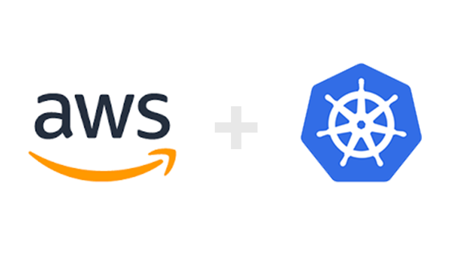

# Kubernets_Integration_AWS



I have created 3 ansible roles to configure the multinode cluster over aws:
1. aws_instances: This role launches 3 ec2 instances over amazon cloud and dynamically updates the inventory file to configure the master and two worker nodes.
2. k8s_master: This role downloads the essential packages and configure the kubernetes master node.
3. k8s_worker: This role downloads the essential packages and configure two kubernetes worker nodes.

#### My inventory file code 
```
[defaults]
inventory= /ip.txt
host_key_checking= false
ask_pass= False
roles_path= /etc/ansible/
private_key_file=awsKey.pem
remote_user=ec2-user

[privilege_escalation]
become= true
become_method= sudo
become_user= root
become_ask_pass= false
~
```
Here, we need to give the path where all the roles are present. In my case I have the roles in ` /etc/ansible/`, we also need to give the .pem file fo aws with the key word `private_key= <keyname>`

### To run the script
`ansible-playbook play.yml`
